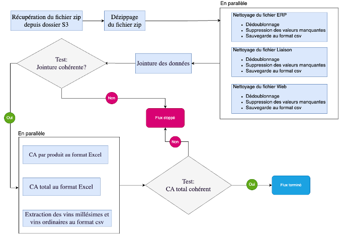

# Treatment automation

Ce projet met en place l'environnement permettant d'automatiser une chaîne de traitement et d’analyse de données.

## Prérequis

- docker
- docker-compose

## Installation

1. **Cloner le dépôt**

```bash
git clone https://github.com/nau81000/treatment_automation.git
cd treatment_automation
```

2. **Définir les variables d'environnement (utilisées dans docker-compose.yml)**

```bash
# Copier le template et éditer le fichier .env
cp .env.template .env
```

| Variable | Description |
| -------- | -------     |
| DOCKER_SOCK_PATH | packages additionnels utilisés dans Airflow |
| POSTGRES_DB | Nom donnée au DAG Airflow  |
| POSTGRES_USER | UID de l'utilisateur utilisé par Airflow
| POSTGRES_PASSWORD | ACCESS_KEY_ID pour accéder au dossier S3 d'Amazon |

## Structure principale du projet

```
├── docker-compose.yml             # Paramètrages des services
├── config/                        # Modules utilisés par les services
│   ├── prometheus/                     
│       ├── prometheus.yml         # Configuration du service Prometheus
├── examples/                      # Example d'orchestration à importer dans Kestra
```

## Utilisation

Docker-compose permet de créer automatiquement l'environnement de travail: création et initialisation des bases de données, lancement des services.

- Construction de l'environnement avec la commande:

```
docker-compose up -d
```

- Destruction des containers de l'environnement avec la commande:

```
docker-compose down -v
```

- Destruction des volumes de l'environnement et de tous les volumes Docker inutilisés avec la commande: 

```
docker volume prune -f -a
```

## Exemple de diagramme de flux


